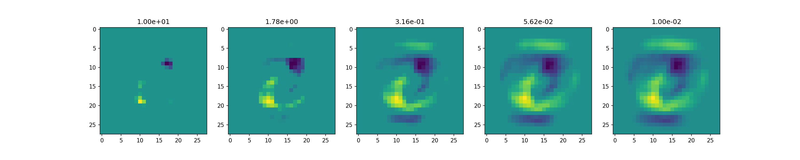

# custom optimizers

自分で最適化アルゴリズムを実装してみるサンプル

## 実装しているもの

* [Regularized Dual Averaging method](https://www.microsoft.com/en-us/research/wp-content/uploads/2016/02/xiao10JMLR.pdf)
* L1SGD: L1正則化項を考慮したSGD (上記と同じ論文)

## 実行

```bash
python main.py
```

## 結果


