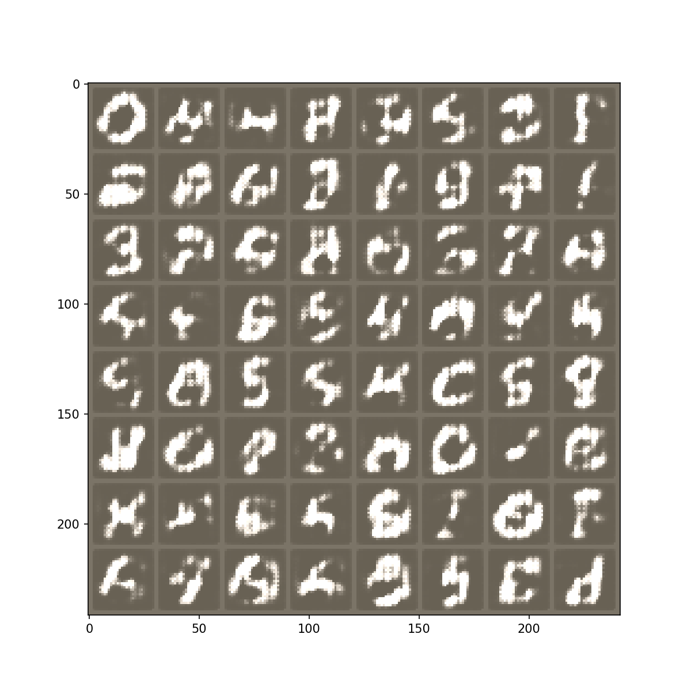
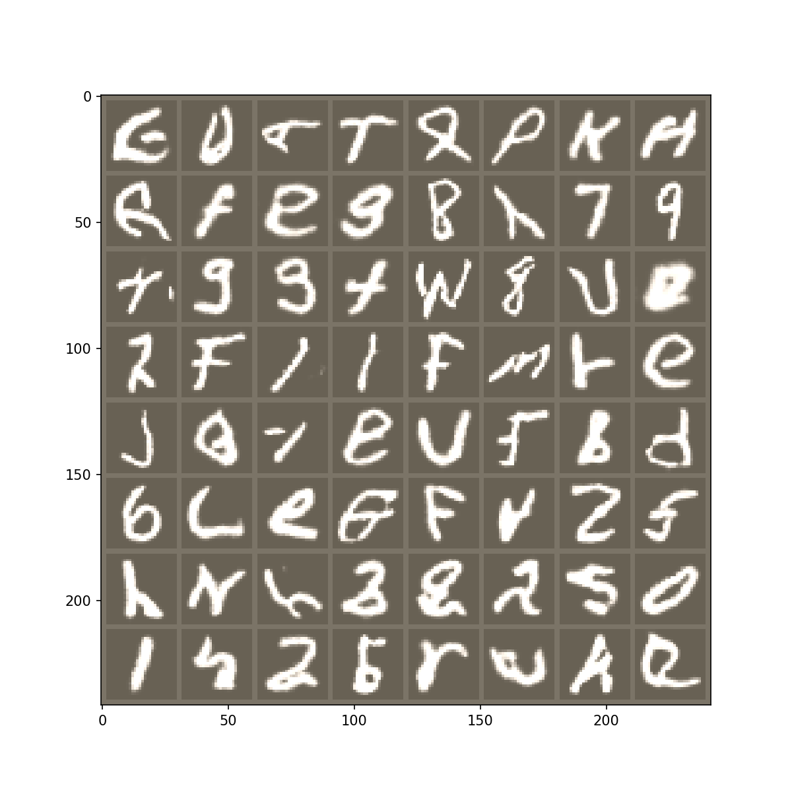

# DCGAN

pytorch 0.4 での DCGAN の実装

データセットは EMNIST を用いています。

## Run

```bash
python main.py
```

## Results

> epoch 1



> epoch 30




## 実装詳細

### solver.py

学習時のデータの GPU への以降やエポック開始前と終了時に callback を実行するヘルパークラスである `Solver` クラスを定義しているファイルです。
`set_optimizers`: 最適化アルゴリズムを定義するメソッド と `_core_forward_backward`: forward backward から loss.backward()を呼び出すメソッド を継承先クラスで実装して用います。
